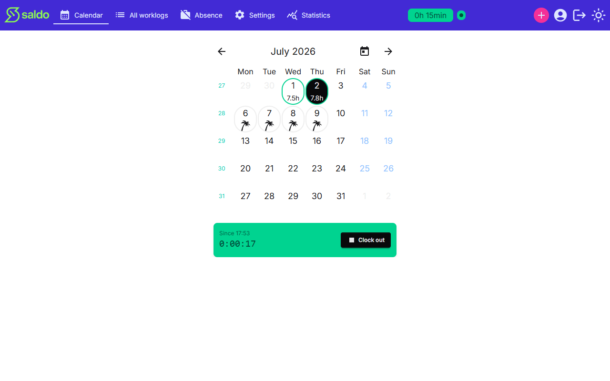
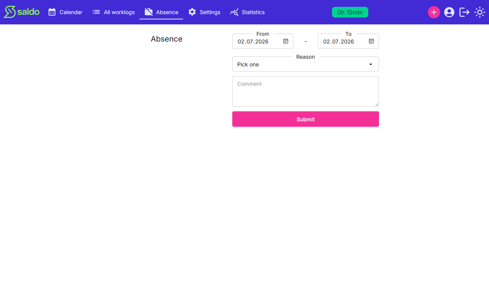

<div align="center">


**Know exactly how far ahead — or behind — you are.**

<br>

[](https://saldo-worklog.vercel.app)
&nbsp;
[](https://oskkos.github.io/saldo/)
&nbsp;
[](docs/getting-started.md)

<br>

[](https://github.com/oskkos/saldo/actions/workflows/build.yml)
[](https://github.com/oskkos/saldo/actions/workflows/docs.yml)
[](https://codecov.io/gh/oskkos/saldo)
[](LICENSE)


</div>

---

## What is Saldo?

Saldo tracks your working hours and keeps a single running balance — your **saldo** — between the hours you actually worked and the hours expected of you. Positive means you're ahead; negative means you owe time.

The balance counts forward from a begin date you choose, starting from an optional initial balance. Expected hours accrue only on working days, so weekends and public holidays never count against you. Worked hours count on any day you log them.


## Features

- **A running saldo badge** in the top bar, updated every time you record time — no report to run.
- **Log a work day** with start and end times, an optional lunch-break subtraction, and a comment.
- **Clock in and out** to time a session live instead of typing times, with a running timer and a clocked-in indicator visible from anywhere.
- **Record absences** over a single day or a date range — holiday, flex hours, sick leave, or other — each affecting the balance according to its reason.
- **Statistics** covering the same window as your saldo: totals, daily average, most and least hours, absences by reason, and a per-day chart.
- **Expected hours your way** — set a default per day, and override individual dates with special days for half-days and the like.
- **Sign in** with Google, GitHub, or email and password.

## Screenshots

|                                                                                                       |                                                                                           |
| ----------------------------------------------------------------------------------------------------- | ----------------------------------------------------------------------------------------- |
| <br>**Log a day**    | <br>**Clock in/out** |
| <br>**Absences** | <br>**Statistics**       |

## Quick start

```bash
docker compose up -d db   # Postgres on localhost:3006
./run-migrations.sh       # prisma migrate deploy
docker compose up         # app on http://localhost:3000
```

Running without Docker, the full environment variable list, and the non-local auth setup are in **[Getting started](docs/getting-started.md)**.

## Tech stack

|               |                                                                        |
| ------------- | ---------------------------------------------------------------------- |
| **Framework** | Next.js 16 (App Router, server-first) · React 19 · TypeScript (strict) |
| **Data**      | Prisma 7 + PostgreSQL via the `pg` adapter                             |
| **Auth**      | NextAuth 4 — Credentials, Google, GitHub (JWT sessions)                |
| **UI**        | Tailwind 4 + daisyUI · Chart.js · react-hook-form + Zod                |
| **Dates**     | dayjs (all math in UTC) · `date-holidays` for public holidays          |
| **Testing**   | Jest + Testing Library · Playwright · Codecov                          |
| **Ops**       | Sentry · Vercel                                                        |

## Development

| Command                 | What it does                                 |
| ----------------------- | -------------------------------------------- |
| `npm run dev`           | Dev server on port 3000                      |
| `npm run build`         | Production build                             |
| `npm run test:ci`       | Jest, single run with coverage               |
| `npm test`              | Jest in **watch mode** — does not exit       |
| `npm run test:e2e`      | Playwright end-to-end suite                  |
| `npm run lint`          | ESLint (`--max-warnings=0`) + Prettier check |
| `npm run lint:fix`      | ESLint `--fix` + Prettier `--write`          |
| `npm run spec:coverage` | Regenerate `openspec/COVERAGE.md`            |

Run a single Jest test with `npx jest src/services/__tests__/someFile.test.ts` (add `-t "name"` to filter). The e2e suite needs a one-time database and `.env.e2e` setup — see **[`e2e/README.md`](e2e/README.md)**.

Commits go through Husky: `lint-staged` on pre-commit, and commitlint enforcing [Conventional Commits](https://www.conventionalcommits.org/) on the message.

### Architecture

Data flows `page/component → action → repository → Prisma`, with pure business logic kept to the side:

- **`src/app/`** — App Router pages, async server components by default.
- **`src/actions/`** — the single `'use server'` module; every mutation validates with Zod, then delegates.
- **`src/repository/`** — `server-only` data access that enforces per-user ownership on every call.
- **`src/services/`** — pure, side-effect-free domain logic: the saldo calculation itself.

The conventions that are easy to trip over — branded date types, UTC-only date math, the generated Prisma client location — are documented in **[`CLAUDE.md`](CLAUDE.md)**.

## Testing & quality

Two test layers cover near-complementary halves of the codebase and report to Codecov under separate flags: Jest (`unit`) holds the services, repository, and util layers; Playwright (`e2e`) drives every page and component. Only the pair describes the whole, which is why both carry forward.

Beyond coverage, CI enforces **spec-to-test traceability**: every scenario in `openspec/specs/` must be claimed by a test or explicitly exempt, and every requirement needs at least one Playwright test or a categorised exemption. Tests declare what they cover inline:

```ts
// @scenario time-clock/Clock in when idle
it('records the session start', () => { ... })
```

The generated map lives in **[`openspec/COVERAGE.md`](openspec/COVERAGE.md)**.

## Documentation

- **[User guide](https://oskkos.github.io/saldo/)** — task-oriented guide for people using Saldo, generated from the specs.
- **[Getting started](docs/getting-started.md)** — full local setup and environment variables.
- **[`openspec/`](openspec/)** — capability specs and the change workflow.
- **[`CLAUDE.md`](CLAUDE.md)** — architecture, conventions, and the contribution workflow in detail.

## License

[MIT](LICENSE) © Oskari Kosonen
