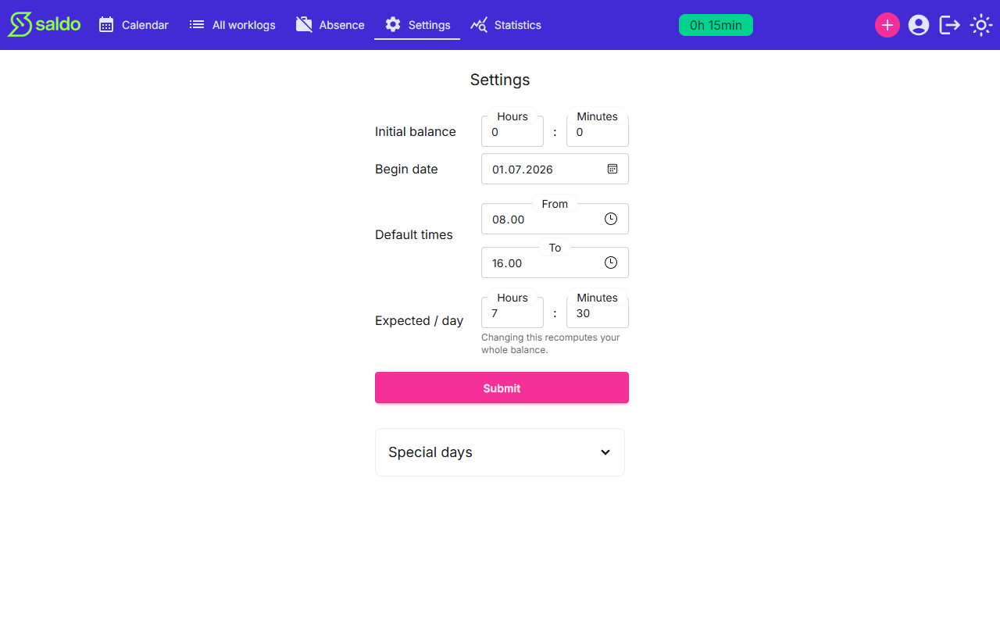
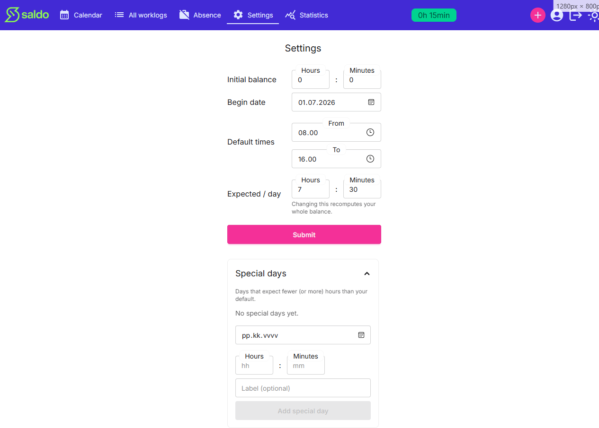

# Account & expected hours

Settings control how your saldo is calculated. Because these values drive the whole
balance, changing them recomputes it from your begin date forward.

## Your settings

From **Settings** you can set:

- **Initial balance** — the hours/minutes your saldo starts from, before any work is
  counted.
- **Begin date** — the day your saldo starts counting.
- **Default times** — the start and end times pre-filled when you log a work day.
- **Expected / day** — the hours expected of you on a normal working day.

Press **Submit** to save. Changing **Expected / day** recomputes your whole balance.

## Special days (per-date expected hours)

Some days expect fewer (or more) hours than your default — a half-day before a
holiday, for example. Open **Special days** to add an override: pick the **date**, set
the **hours and minutes** expected on that day, and give it an optional **label**.
Saldo uses the override when working out what was expected on that specific date, and
falls back to your default everywhere else.

<!-- traceability -->

> **Generated from OpenSpec specs** — do not hand-edit; run `/generate-user-guides` to update.
>
> | Capability | Requirement | Hash |
> | --- | --- | --- |
> | settings | Update settings | `525ce111f724` |
> | expected-hours | Expected minutes are resolved per date | `ee73e35a733d` |
> | expected-hours | Per-date expected-hours overrides | `cfe84ecfa9f2` |

<!-- /traceability -->
