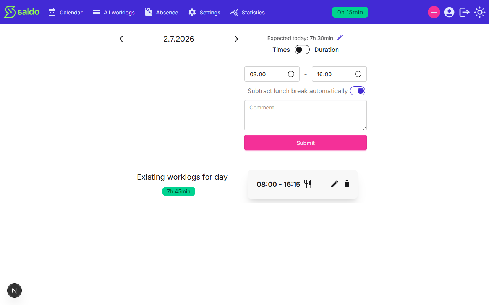

# Logging a work day

Record the hours you worked on a given day. Each entry feeds into your running
saldo — the balance between the hours you've worked and the hours expected of you.

## Open the day

From the calendar, click the day you want to log. The day view shows the date,
the hours **expected** for that day, and a form for entering your work time. Use
the arrows beside the date to move to the previous or next day.

## Enter your hours

You can record time in two ways, using the **Times / Duration** toggle:

- **Times** — type a start and end time (for example a morning start and an
  afternoon finish).
- **Duration** — switch the toggle to enter a single length of time instead of a
  start/end pair.

Leave **Subtract lunch break automatically** on to have the standard lunch break
deducted from the entry, or turn it off to log the exact time. You can add an
optional **comment**, then press **Submit** to save the entry.

## Review, edit, or delete entries

Saved entries for the day appear under **Existing worklogs for day**, with a total
for the day. Each entry has an edit and a delete control — use them to correct a
mistake or remove an entry. You can only change your own worklogs.

Once saved, the day's hours are reflected in your saldo.

<!-- traceability -->

> **Generated from OpenSpec specs** — do not hand-edit; run `/generate-user-guides` to update.
>
> | Capability | Requirement | Hash |
> | --- | --- | --- |
> | worklog | Create a worklog | `facc182bad45` |
> | worklog | Worklog entry supports a duration mode | `7adcb5fa9602` |
> | worklog | Edit a worklog only if owned | `df10405f2a0a` |
> | worklog | Delete a worklog only if owned | `70a910bd8992` |

<!-- /traceability -->
