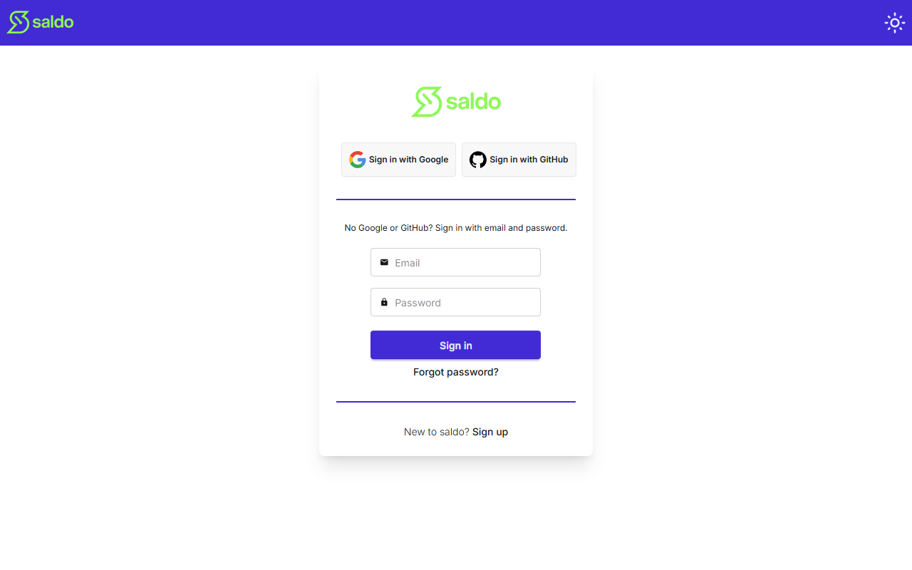

# Signing in & your account

Saldo is private to you — you sign in before you can see or record any hours.

## Ways to sign in

The sign-in screen offers three options:

- **Sign in with Google** or **Sign in with GitHub** — one-click sign-in with an
  existing account. The first time you use one of these, Saldo creates your account
  automatically.
- **Email and password** — enter your email and password and press **Sign in**.

## New here?

Choose **Sign up** to create an account with your email and a password. Sign-up
checks that your details are valid before the account is created.

## Forgot your password?

Choose **Forgot password?** and enter your email to request a reset link. For your
privacy, Saldo shows the same confirmation whether or not an account exists for that
address, so the response never reveals who has an account. Follow the link in the
email to set a new password; the link is only valid for a limited time.

<!-- traceability -->

> **Generated from OpenSpec specs** — do not hand-edit; run `/generate-user-guides` to update.
>
> | Capability | Requirement | Hash |
> | --- | --- | --- |
> | auth | Email/password sign-in | `b802d2da3147` |
> | auth | OAuth sign-in | `ed87cd984d8f` |
> | auth | Sign-up with validated credentials | `04080748bad1` |
> | auth | Forgot-password does not reveal account existence | `7b24d8cf8d26` |
> | auth | Reset password with a valid token | `d82a6633ea32` |

<!-- /traceability -->
