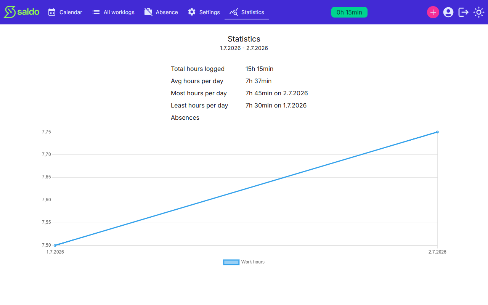

# Statistics

The **Statistics** view summarises the same period your saldo covers, so you can see
how your hours break down over time.

## What it shows

- **Hours figures** — the total hours you've logged, your average per day, and your
  most and least hours on a single day.
- **Work vs. absences** — work entries are counted separately from absences, so
  absence days don't distort your worked-hours figures.
- **Absences by reason** — how many absences you've recorded, grouped by their reason.
- **Per-day chart** — a chart of work minutes per day across the period.

The statistics cover the same window as your saldo — from your begin date onward — so
the two views always line up.

<!-- traceability -->

> **Generated from OpenSpec specs** — do not hand-edit; run `/generate-user-guides` to update.
>
> | Capability | Requirement | Hash |
> | --- | --- | --- |
> | statistics | Same window as the saldo | `50a717f62288` |
> | statistics | Separate work entries from absences | `76875e5b5a3d` |
> | statistics | Hours figures | `174cce7a42ef` |
> | statistics | Absence counts by reason | `511a52f28694` |
> | statistics | Per-day work-minutes chart | `9bc0cbd134da` |

<!-- /traceability -->
