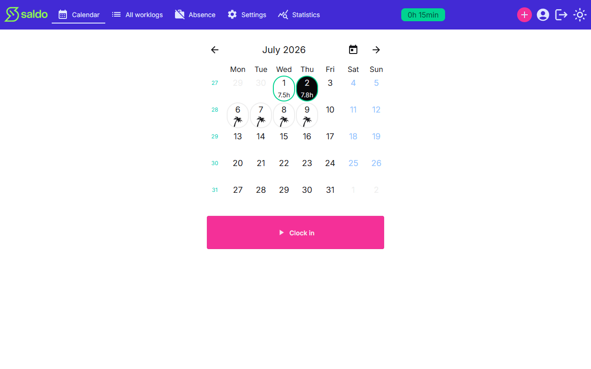

# Understanding your saldo

Your **saldo** is the heart of the app: a single running balance between the hours
you've actually worked and the hours expected of you. A positive saldo means you're
ahead; a negative saldo means you owe hours. It's shown as a badge in the top bar and
updates as you log time.

## How it's calculated

Saldo is counted forward from your **begin date** (set in Settings), starting from an
optional **initial balance**. From there:

- **Expected hours** accrue only on **working days** — weekends and public holidays
  don't add to what's expected of you.
- **Worked hours** count on any day you log them. If an entry has the lunch break
  subtracted, only the net time counts toward your balance.
- Each day, the hours you worked are compared against the hours expected, and the
  difference moves your saldo up or down.

## Absences and your saldo

Recording an absence affects the balance according to its reason — for example,
**flex hours** draw down your saldo, since you're spending balance you built up.
Other absence types are handled so they don't unfairly penalise you on days off.

The result is always shown in a readable form (hours and minutes) so you can tell at
a glance where you stand.

<!-- traceability -->

> **Generated from OpenSpec specs** — do not hand-edit; run `/generate-user-guides` to update.
>
> | Capability | Requirement | Hash |
> | --- | --- | --- |
> | saldo | Running balance from begin date | `d5161ecbdc82` |
> | saldo | Initial balance seeds the sum | `d8c1257ed8fc` |
> | saldo | Expected minutes accrue only on working days | `98e2102a0aa4` |
> | saldo | Worked minutes count on any calendar day | `a8b9016ff990` |
> | saldo | Worked minutes net of lunch break | `363fcc5834ec` |
> | saldo | Flex-hours absence draws down the balance | `f21fc82c3486` |
> | saldo | Saldo formatted as hours, minutes, string, and badge | `842035b72d2c` |

<!-- /traceability -->
