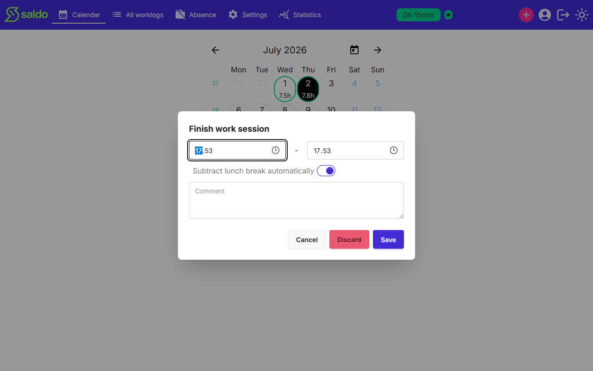

# Using the clock

Instead of typing start and end times, you can let Saldo time your work session live
— clock in when you start, clock out when you finish.

## Clock in

Press **Clock in** to start a session. A running timer appears showing when you
started and how long you've been clocked in, and a **Clocked in** indicator shows in
the top bar so the state is visible from anywhere in the app. You can only have one
open session at a time.

## Clock out

Press **Clock out** to finish. Saldo opens a **Finish work session** dialog
pre-filled with the start and end times, where you can adjust the times, choose
whether to subtract the lunch break automatically, and add a comment before saving.

- **Save** turns the session into a worklog for the day.
- **Discard** throws the session away without logging anything.
- **Cancel** closes the dialog and leaves the session running.

A session is meant to cover a single day, so it can't stretch across more than one
day. If you forget to clock out, Saldo helps you finish the leftover session the next
time you return.

## If the session overlaps hours you already logged

A session you are saving is checked against your stored work entries in exactly
the same way a typed entry is. If its span runs over one of them, Saldo asks
before saving, naming the date and time span it would land on.

Choose **OK** to save the session anyway. Choose **Cancel** and nothing is
written — and, importantly, **you stay clocked in with the session untouched**.
Your tracked time isn't lost, so you can reopen the dialog, correct the times,
and save or discard from there.

Pressing **Save** twice cannot log the session twice: once a session has been
turned into a worklog it is closed, and a repeat press — or a press from a second
device — adds nothing further.

<!-- traceability -->

> **Generated from OpenSpec specs** — do not hand-edit; run `/generate-user-guides` to update.
>
> | Capability | Requirement | Hash |
> | --- | --- | --- |
> | time-clock | Clock in starts a single open session | `d0ccf9e6fed2` |
> | time-clock | Clock out finalizes the session | `04fd85379fcb` |
> | time-clock | Discard a session without logging | `ea217d1a6747` |
> | time-clock | Sessions may not span more than one day | `1b505f7b70e2` |
> | time-clock | Forgotten sessions are handled on return | `753eeb7fbf47` |
> | time-clock | Clock state is visible across the app | `392eb5cef249` |
> | time-clock | A declined overlap leaves the session open | `9b6e7dfad545` |
> | time-clock | Finalizing a session twice creates one worklog | `aad85de8a296` |
> | worklog | Work entries do not silently overlap | `c5bab5b7ae76` |

<!-- /traceability -->
